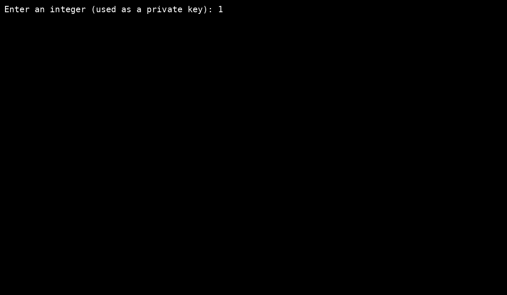

<p align="center">
  
</p>

# 🔐 BITCOIN KEY EXPLORER

**bitcoin_key_explorer** is a simple, offline Python tool that converts any integer into a Bitcoin private key and displays the corresponding public key, WIF, and address in both compressed and uncompressed formats.

It takes an integer and outputs:
- Bitcoin address (compressed & uncompressed)
- WIF format (compressed & uncompressed)
- Public key (HEX)
- Private key (HEX)

---

## ⚙️ Features

- 🔐 Converts integer to private key
- 📬 Generates Bitcoin addresses (compressed & uncompressed)
- 🔑 Shows WIF formats
- 🔎 Public + private key in HEX
- 🖥️ Terminal color output
- 🧠 Optional Base58 address decoder

---

## 📁 File Overview

- `bitcoin_key_explorer.py` – Main key generation and address derivation tool  
- `bitcoin_key_explorer.bat` – Windows launcher for quick use  
- `.vscode/`  
  - `settings.json` – Editor preferences  
  - `launch.json` – Debugging configuration  
  - `tasks.json` – Task runner integration  
  - `extensions.json` – Recommended VS Code extensions  
- `assets/`  
  - `banner.png` – Project banner  
  - `demo.gif` – Demo preview  
- `README.md` – This documentation  
- `LICENSE` – Apache 2.0 License  
- `NOTICE` – Attribution and notices  
- `ETHICS` – Responsible use notice  
- `RELEASE_v1.0.0.md` – Version 1.0.0 changelog  
- `RELEASE_v2.0.0.md` – Version 2.0.0 changelog  
- `requirements.txt` – Python dependencies

---

## 🛠️ Dependencies

```
ecdsa
pycryptodome
base58
termcolor
```

Install with:

```bash
pip install -r requirements.txt
```

> Python 3.8+ is recommended.

---

## 🚀 Usage

### Option 1 – via Python:
```bash
python bitcoin_key_explorer.py
```

### Option 2 – via `.bat` launcher (Windows):
```cmd
bitcoin_key_explorer.bat
```

---

## 📦 Example Output

```
Bitcoin Address (Uncompressed): 1...
Bitcoin Address (Compressed):   1...
WIF (Uncompressed): 5...
WIF (Compressed):   K...
Public Key (Uncompressed HEX): 04...
Public Key (Compressed HEX):   02...
Private Key (HEX): a3...
```

---

## 📂 Project Structure

```text
bitcoin_key_explorer/
├── assets/
│   ├── banner.png
│   └── demo.gif
├── .vscode/
│   ├── settings.json
│   ├── launch.json
│   ├── tasks.json
│   └── extensions.json
├── bitcoin_key_explorer.py
├── bitcoin_key_explorer.bat
├── LICENSE
├── NOTICE
├── ETHICS
├── README.md
├── RELEASE_v1.0.0.md
├── RELEASE_v2.0.0.md
└── requirements.txt
```

---

## 🎬 DEMO

<p align="center">
  
</p>

---

## ⚠️ DISCLAIMER

This software is provided strictly for **educational, analytical, and research purposes only**.

The author **does not promote or condone** any unethical behavior, unauthorized access, or abuse of blockchain systems or cryptographic tools.

This project **does not include or generate any real private keys** linked to actual cryptocurrency holdings.  
It is designed to operate in **offline environments** or for simulation/testing purposes.

**The author accepts no liability** for any damages, losses, or illegal use resulting from this software.  
All responsibility lies solely with the end user.

> **Use responsibly. Learn ethically. Contribute honestly.**

---

## ⚖️ Ethical Use

This tool is created strictly for **research and educational purposes**.  
See [ETHICS](./ETHICS.md) for the full statement.

---

## 📜 License

Licensed under the [Apache 2.0 License](./LICENSE)

---

## 📣 NOTICE

See [`NOTICE`](./NOTICE) for important information about attribution, DMCA protection, and reuse permissions.

---

## 🍱 Support

★ **Bitcoin (BTC)**  
`1MorphXyhHpgmYSfvwUpWojphfLTjrNXc7`

★ **Monero (XMR)**  
`86VAmEogaZF5WDwR3SKtEC6HSEUh6JPA1gVGcny68XmSJ1pYBbGLmdzEB1ZzGModLBXkG3WbRv12mSKv4KnD8i9w7VTg2uu`

★ **Dash (DASH)**  
`XtNuNfgaEXFKhtfxAKuDkdysxUqaZm7TDX`

**We also value early privacy coins such as:**  
★ **Bytecoin (BCN)**  
`bcnZNMyrDrweQgoKH6zpWaE2kW1VZRsX3aDEqnxBVEQfjNnPK6vvNMNRPA4S7YxfhsStzyJeP16woK6G7cRBydZm2TvLFB2eeR`

🙏 *Thank you for supporting independent research and ethical technology.*

---

## 👤 Author & Contact

🔗 GitHub: https://github.com/BitMorphX  
✉️ Email: BitMorphX@proton.me  
💬 Telegram: https://t.me/BitMorphX

> _“I morph bits, not to break, but to understand.”_  
> — **BitMorphX**

---

© BitMorphX – All rights reserved.
